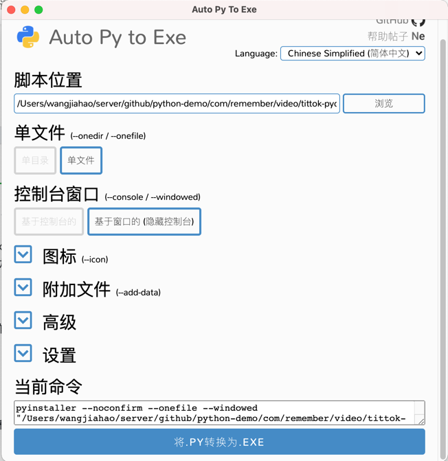

# designer

转换命令
```shell
pyuic5 -o qt1.py qt1.ui
```


# PyQt5程序->DMG

假设PyQt5项目的目录结构如下： 
|– src – 源代码 
|– resources – 相关资源文件，如图片等 
|– main.py – 程序入口 
|– icon.icns – iOS下的icon文件


使用Pyinstaller将PyQt5程序打包生成APP
在项目的目录下，执行如下命令：
```shell
pyinstaller -F -w -i icon.icns hello.py
```

执行后，会在项目所在目录下，生成2个文件夹和1个文件：build、dist和main.spec。生成的可执行文件和app文件就在dist目录下。 
但是运行后会发现，resources目录下相关的资源并没有被打包进去。 
通过修改main.spec文件，即可将resources目录的相关资源打包进去。 
main.spec文件内容如下：

```python
# -*- mode: python -*-

block_cipher = None


a = Analysis(['hello.py'],
             pathex=['项目所在目录'],
             binaries=[],
             datas=[],
             hiddenimports=[],
             hookspath=[],
             runtime_hooks=[],
             excludes=[],
             win_no_prefer_redirects=False,
             win_private_assemblies=False,
             cipher=block_cipher)
#遍历mydir目录，将其下所有文件都打包
def extra_datas(mydir):
    def rec_glob(p, files):
        import os
        import glob
        for d in glob.glob(p):
            if os.path.isfile(d):
                files.append(d)
            rec_glob("%s/*" % d, files)
    files = []
    rec_glob("%s/*" % mydir, files)
    extra_datas = []
    for f in files:
        extra_datas.append((f, f, 'DATA'))

    return extra_datas

# append the 'resources' dir
a.datas += extra_datas('resources')

pyz = PYZ(a.pure, a.zipped_data, cipher=block_cipher)
exe = EXE(pyz,
          a.scripts,
          a.binaries,
          a.zipfiles,
          a.datas,
          name='main',
          debug=False,
          strip=False,
          upx=True,
          console=False , icon='icon.icns')
app = BUNDLE(exe,
             name='应用名称.app',
             icon='icon.icns',
             bundle_identifier=None)
```

需要注意的是，mac os下的icon文件后缀为icns。 
编辑完成后，在命令行下执行如下命令，即可生成将resources下所有相关资源打包的可执行文件和app文件。

```shell
pyinstaller main.spec
```


# 使用可视化打包
```shell
pip install auto-py-to-exe
auto-py-to-exe
```




这样会打包成unix和mac的app


